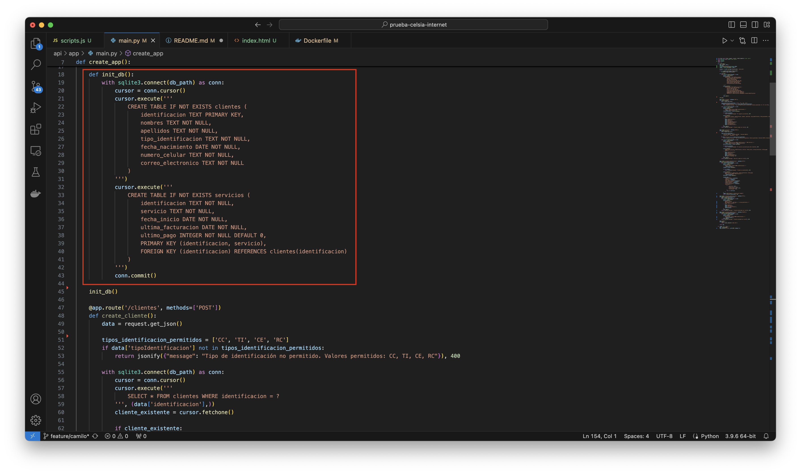

# Sustentación Prueba Técnica Celsia

## 1. Puntos Evaluados Para La Prueba

### 1.1 CRUD


__1.1.1 Crear Usuario__


__1.1.2 Leer Usuario__


__1.1.3 Actualizar Usuario__


__1.1.4 Eliminar Usuario__


### 1.2 Validaciones

__1.2.1 Datos Sin Blancos__


__1.2.2 Datos con Estructura Solicitada__


__1.2.3 Registro Ya Existente__


### 1.3 Registro de Servicios a Clientes


### 1.4 Consulta de Cliente con Servicios


### 1.5 Consideraciones

__1.5.1 Tipo de Identificación Limitado__


__1.5.2 Servicios Limitados__


__1.5.3 Frontend/Backend__


__1.5.4 Docker Compose Backend__


__1.5.5 Estructura GitHub__

```
prueba-celsia-internet/
├── api/
│ ├── app/
│ │ ├── main.py
│ │ └── routes/
│ ├── instance/
│ │ └── celsia.db
│ ├── Dockerfile
│ ├── docker-compose.yml
│ ├── README.md
│ └── requirements.txt
├── webapp/
│ ├── static/
│ │ ├── css/
│ │ │ └── styles.css
│ │ ├── js/
│ │ │ └── scripts.js
│ │ └── images/
│ ├── templates/
│ │ └── index.html
│ ├── Dockerfile
│ ├── docker-compose.yml
│ ├── nginx.conf
│ └── README.md
├── assets/
│ ├── registros/
│ └── diagrama.png
└── README.md
```

## 2. Aplicación

### 2.1 Diagrama de Componentes


### 2.2 ¿Qué mecanismos de seguridad incluirías en la aplicación para garantizar la protección del acceso a los datos?

 RTA: Para proteger el acceso a los datos, lo primero que haría es implementar autenticación y autorización robusta, como OAuth o JWT. Además, cifraría las comunicaciones entre el frontend y el backend con HTTPS y los datos sensibles en la base de datos, usando AES por ejemplo. También, sería buena idea limitar el acceso a la base de datos solo desde el backend y no directamente desde otros servicios. Por supuesto, tener registros de auditoría para saber quién accede a qué información y cuándo, es indispensable para detectar y prevenir accesos indebidos.

### 2.3 ¿Qué estrategia de escalabilidad recomendarías para la aplicación considerando que el crecimiento proyectado será de 1,000,000 de clientes por año?

RTA: 1 millón de clientes por año no es poca cosa. Para manejar eso, recomendaría una arquitectura basada en microservicios, que permita a la empresa escalar cada parte de la aplicación de manera independiente. Por ejemplo, el servicio que maneja las consultas de clientes podría escalarse según la demanda, sin tener que escalar otros componentes que no se usen tanto. También, sería importante usar una base de datos que soporte dicho escalamiento como MongoDB o PostgreSQL. Y claro, todo esto en la nube, usando Kubernetes para orquestar los contenedores y garantizar la escalabilidad automática.

### 2.4 ¿Qué patrón o patrones de diseño recomendarías para esta solución y cómo se implementarían? (Justifique)

RTA: Para esta aplicación, yo recomendaría usar el patrón Model-View-Controller en el backend, que separa la lógica de negocio de la interfaz de usuario y facilita el mantenimiento y la escalabilidad. El modelo manejaría los datos y la lógica de negocio, el controlador las peticiones del usuario, y la vista presentaría los datos al usuario. 

### 2.5 ¿Qué recomendaciones harías para optimizar el manejo y la persistencia de datos de la aplicación, teniendo en cuenta que esta aplicación tiene una alta transaccionalidad?

RTA: Bueno, lo primero sería implementar una estrategia de caching para las consultas más frecuentes, usando algo como Redis para reducir la carga en la base de datos. También, asegurarse de que las transacciones en la base de datos sean lo más cortas posible, para evitar bloqueos y mejorar la concurrencia. Otra recomendación sería usar índices en las columnas que más se consultan, pero sin exagerar, porque demasiados índices pueden ralentizar las inserciones y actualizaciones. Y si la transaccionalidad es muy alta, considerar un sistema de base de datos distribuido que permita replicación y alta disponibilidad.

## 3. Redes

### 3.1. Explica la diferencia entre un router y un switch. ¿Cuándo usarías cada uno?

RTA: Un switch se encarga de conectar dispositivos dentro de una misma red local, básicamente para que puedan comunicarse entre sí. En cambio, un router conecta diferentes redes, como tu red local con Internet, y además se encarga de dirigir el tráfico entre esas redes. Usaría un switch en una oficina para conectar las computadoras, impresoras, etc., y un router para conectar esa oficina a Internet y a otras sucursales.

### 3.2. Describe las siete capas del modelo OSI y menciona brevemente la función principal de cada una

RTA:

1. __Capa Física__: Se encarga de los aspectos físicos de la transmisión, como cables y señales eléctricas.
2. __Capa de Enlace de Datos__: Maneja el direccionamiento físico (direcciones MAC) y el control de acceso al medio.
3. __Capa de Red__: Aquí es donde se maneja el enrutamiento y la dirección lógica (IP).
4. __Capa de Transporte__: Se encarga de la entrega confiable de datos, con protocolos como TCP.
5. __Capa de Sesión__: Maneja el establecimiento y finalización de sesiones entre aplicaciones.
6. __Capa de Presentación__: Se encarga de la traducción de datos entre la red y la aplicación, como el cifrado.
7. __Capa de Aplicación__: Es la capa más cercana al usuario, donde están los protocolos como HTTP, FTP, etc.

### 3.3. Explica las diferencias entre los protocolos TCP y UDP. Dar un ejemplo de cuándo usarías cada uno?

RTA: TCP es un protocolo orientado a la conexión, que garantiza que los datos lleguen completos y en orden. Es ideal para aplicaciones donde la fiabilidad es crucial, como cuando cargas una página web. UDP, en cambio, es un protocolo sin conexión, donde la velocidad es más importante que la fiabilidad, perfecto para cosas como videollamadas o juegos en línea, donde perder uno que otro paquete de datos no es tan grave.

### 3.4. ¿Qué es una máscara de subred y cómo se utiliza para dividir una red en subredes más pequeñas?

RTA: Una máscara de subred es un número que separa la parte de una dirección IP que identifica la red y la parte que identifica los hosts dentro de esa red. Se utiliza para dividir una red grande en subredes más pequeñas, lo que ayuda a mejorar la eficiencia y seguridad de la red. Por ejemplo, en una empresa podrías usar subredes diferentes para los departamentos de ventas y desarrollo.

### 3.5. ¿Puedes mencionar algunos protocolos de enrutamiento dinámico y explicar brevemente cómo funcionan?

RTA: Claro, algunos protocolos de enrutamiento dinámico son OSPF, RIP, y BGP. OSPF (Open Shortest Path First) calcula la ruta más corta usando un algoritmo de estado de enlace. RIP (Routing Information Protocol) es más sencillo, usa la cantidad de saltos para determinar la mejor ruta. BGP (Border Gateway Protocol) se usa principalmente en Internet, para enrutar entre diferentes sistemas autónomos. Estos protocolos permiten que los routers se comuniquen entre sí y ajusten las rutas automáticamente según cambien las condiciones de la red.

## 4. Gestión de Proyectos

### 4.1. ¿En qué grupos de procesos de dirección de proyectos es creado un presupuesto detallado del proyecto?

RTA: El presupuesto detallado del proyecto se crea durante el grupo de procesos de planificación, ahí se desarrollan los costos y se establece el presupuesto necesario para completar las actividades del proyecto.

### 4.2. ¿En qué grupo de procesos de la dirección de proyectos es creada el acta de constitución del proyecto?

RTA: El acta de constitución del proyecto se crea en el grupo de procesos de inicio. Este documento es el que formaliza la existencia del proyecto y autoriza al líder del proyecto a asignar recursos.

### 4.3. El equipo de proyecto acaba de completar el primer cronograma y presupuesto del proyecto. La próxima cosa a hacer es:

RTA: La próxima cosa a hacer es obtener la aprobación formal del cronograma y presupuesto, para luego proceder a la ejecución del plan del proyecto.

### 4.4. Un primer cronograma del proyecto puede ser creado solamente después de crear:

RTA: El primer cronograma del proyecto puede ser creado solamente después de definir el alcance del proyecto y descomponerlo en tareas específicas. Sin saber qué hay que hacer, no puedes planificar cuándo hacerlo.

### 4.5. Una persona que debe estar al mando durante la planificación de la gestión del proyecto es:

RTA: El gerente del proyecto, por supuesto. Es quien se asegura de que todos los aspectos del proyecto se planifiquen adecuadamente y de que el plan se ajuste a los objetivos del proyecto.

### 4.6. ¿Cuáles son las entradas del grupo de procesos de inicio de un proyecto?

RTA: Las entradas del grupo de procesos de inicio incluyen el acta de constitución del proyecto, el contrato si es aplicable, los factores ambientales de la empresa, y los activos de los procesos organizacionales.

### 4.7. El patrocinador del proyecto acaba de aprobar el acta de constitución del proyecto, ¿cuál es la próxima cosa a hacer?

RTA: La próxima cosa a hacer es comenzar con la planificación del proyecto, que incluye definir el alcance, crear el cronograma y desarrollar el plan de gestión del proyecto.

### 4.8. Acaban de ser establecidas las restricciones de alto nivel del cronograma del proyecto. ¿En qué grupo de procesos de dirección de proyectos se encuentra?

RTA: Se encuentran en el grupo de procesos de planificación. Es en esta fase donde se definen y documentan todas las restricciones y supuestos que guiarán el proyecto.

### 4.9. ¿Qué grupos de procesos deben ser incluidos en cada proyecto?

RTA: Todos los proyectos deben incluir los grupos de procesos de inicio, planificación, ejecución, monitoreo y control, y cierre. Cada uno es esencial para el éxito del proyecto.

### 4.10. ¿Qué grupo de procesos de la dirección de proyecto necesita normalmente el mayor tiempo y número de recursos?

RTA: El grupo de procesos de ejecución suele ser el que más tiempo y recursos consume. Es en esta fase donde se llevan a cabo las actividades planificadas, se asignan los recursos y se completan las tareas para cumplir con los objetivos del proyecto. Aquí es donde el trabajo realmente "sucede", por lo que es lógico que sea la fase más intensiva en términos de recursos.

## 5. Caso Practico:

Para enfrentar el reto de Celsia Internet y su expansión, donde planean llegar a un millón de clientes en cinco años, es vital construir un sistema de liquidación y facturación que no solo funcione ahora, sino que también sea capaz de crecer y mantenerse firme con el tiempo, todo esto sin descuidar la seguridad y la confiabilidad. Aquí te cuento cómo lo haría:

__Arquitectura de Microservicios__: Primero, me iría por una arquitectura de microservicios. Esto básicamente divide el sistema en pequeñas piezas independientes que pueden funcionar por sí solas. Si un componente se cae o necesita actualizarse, el resto del sistema sigue funcionando sin problema. Además, esto permite asignar recursos justo donde se necesitan, lo cual es crucial cuando estás manejando un montón de transacciones, como en este caso.

__Procesamiento Asíncrono__: Para la facturación mensual usaría procesamiento asíncrono. Esto significa que las facturas se van generando en el fondo, por grupos, según los ciclos de facturación. Usando colas de mensajes , podemos manejar un montón de datos sin que el sistema se ahogue. Esto ayuda a distribuir las tareas entre varios servicios y evita cuellos de botella.

__Base de Datos Distribuida y Escalable__: Para asegurar que el sistema sea resistente y pueda escalar, usaría una base de datos distribuida. Estas bases de datos permiten repartir los datos entre varios nodos, asegurando que, si uno falla, el sistema sigue funcionando sin problemas. Así, la operación de facturación y recaudo no se ve interrumpida.

__Seguridad y Protección de Datos Personales__: La seguridad es esencial, sobre todo cuando manejas datos personales y financieros. Implementaría cifrado de extremo a extremo para las comunicaciones y para los datos almacenados. Además, el acceso a los datos debe estar controlado con políticas basadas en roles (RBAC) y cada acceso o modificación debe quedar registrado para auditoría.

__Monitoreo y Alertas en Tiempo Real__: Para que el sistema sea confiable y podamos detectar problemas antes de que afecten a los clientes, implementaría un sistema de monitoreo en tiempo real usando herramientas como Prometheus y Grafana. Además, configuraría alertas automáticas para cualquier cosa rara que ocurra en el procesamiento de facturas o el recaudo de pagos. Así podemos reaccionar rápido y evitar que el problema crezca.


